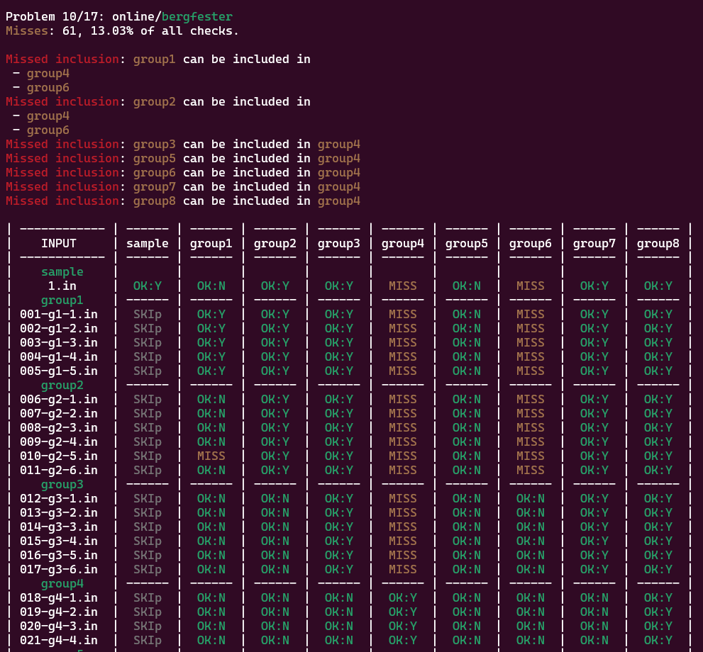

# Subtask Inclusion Checker

## Background

When preparing IOI-style problems in the [Kattis problem package format](https://www.kattis.com/problem-package-format/spec/legacy.html),
it's very common to have subtasks. Each subtask has a set of constraints.
Sometimes, some subtasks are strict subsets of others.
For example:
- Group 1: N <= 100
- Group 2: N <= 1000

In this example, every test case that is in group 1 should also be part of group 2.
Copying all test cases from one group to another will henceforth be referred to as a subtask inclusion.
If you don't include subtasks properly, you might end up with a contestant's solution passing group 2, but not 1, which is obviously wrong.
This does happen in practice, as you might hand-craft small edgecases and then forget to add them to the larger groups.

## The tool

This repo contains `check_subtask_inclusion.py`, a command-line utility that checks for missing subtask inclusions.
It runs each testcase with the input validator flags in each group and checks if it could've been included in said group.
If there are big columns of misses, this probably indicates one of these 3 things:
- You missed a subtask inclusion.
- Your input validator is not strict enough.
- The group is missing max-cases.

One of the easiest ways to manage subtask inclusions is to use [testdata_tools](https://github.com/Kodsport/testdata_tools) to generate test data,
which provides the convenient command `include_group`.

Of course, some subtask constraints are impossible to validate, such as "the input was generated uniformly at random",
in which case you have to live with the false positive.

To use the utility, one options is to run it as a command-line program:
```
python3 check_subtask_inclusion.py <directory>
```

Which will then run the tool on every problem package in `<directory>`.
If you're planning on using this, I would strongly recommend you to use an alias.
If you want to export the results, you can use the command-line option `target-markdown` for output that is optimized for Markdown instead of a console.

If you don't want to worry about remembering to run it manually, you can also install it to run automatically every time you commit to your problem repository.
To do this, simply create the file `.github/workflows/ci.yaml`, and copy the contents of `ci.yaml` into it.
It will then trigger on every push.
With minimal changes, you could make it such that you receive an email every time someone makes a push with missing subtask inclusions.

I also make a big assumption for correctness: no group includes testcases from a group that comes later in Kattis' lexicographic order.
Note that this assumption does not lose expressivity in general, since if you ever have a cycle of the subset relation,
then all groups in the cycle are the same and could be merged into a single group.

## Disclaimers (PLEASE READ!)
First, note that if you run this as part of CI, the script can easily consume lots of compute time (on the order of minutes).
I am not responsible if the script acts up and uses a lot of compute.
As a safety measure, I have put in a 10 minute timeout.
If this is not sufficient, you can increase it in the `ci.yaml` file.

Second, the action has hardcoded to pull the Python script from this repository in order to maximize convenience,
meaning that if I get hacked, the problems could be exfiltrated.
If you don't feel comfortable with this security risk (or don't trust me), here are two reasonable alternatives:
- Fork this repository and modify the action to pull in your fork instead of this repository.
- Copy the Python file to your own repository and modify the action run it directly, removing the need to pull in anything external at all.

I have taken reasonable security measures such as enabling 2FA, but in no event shall I be liable for any
damages resulting from running code in this repository.

Credits to Joakim Blikstad for the idea and writing the first version.

## Sample Output for Console mode

Running via command-line:



## Sample Output for Markdown mode

This is what you will see in the summary tab of the action in Github.


Will check 1 problem.
## Problem 1/1: online/bergfester
### ⚠️Misses: 61, 13.03% of all checks.

❌Missed inclusion: sample can be included in
 - group4
 - group6

❌Missed inclusion: group1 can be included in
 - group4
 - group6

❌Missed inclusion: group2 can be included in
 - group4
 - group6

❌Missed inclusion: group3 can be included in group4

❌Missed inclusion: group5 can be included in group4

❌Missed inclusion: group6 can be included in group4

❌Missed inclusion: group7 can be included in group4

❌Missed inclusion: group8 can be included in group4


<details>


|    INPUT     | sample | group1 | group2 | group3 | group4 | group5 | group6 | group7 | group8 |
| ------------ | ------ | ------ | ------ | ------ | ------ | ------ | ------ | ------ | ------ |
|   #sample    |        |        |        |        |        |        |        |        |        |
|     1.in     |  ✅OK:Y  |  ✅OK:N  |  ✅OK:Y  |  ✅OK:Y  |  ⚠️MISS  |  ✅OK:N  |  ⚠️MISS  |  ✅OK:Y  |  ✅OK:Y  |
|   #group1    | ------ | ------ | ------ | ------ | ------ | ------ | ------ | ------ | ------ |
| 001-g1-1.in  |  SKIP  |  ✅OK:Y  |  ✅OK:Y  |  ✅OK:Y  |  ⚠️MISS  |  ✅OK:N  |  ⚠️MISS  |  ✅OK:Y  |  ✅OK:Y  |
| 002-g1-2.in  |  SKIP  |  ✅OK:Y  |  ✅OK:Y  |  ✅OK:Y  |  ⚠️MISS  |  ✅OK:N  |  ⚠️MISS  |  ✅OK:Y  |  ✅OK:Y  |
| 003-g1-3.in  |  SKIP  |  ✅OK:Y  |  ✅OK:Y  |  ✅OK:Y  |  ⚠️MISS  |  ✅OK:N  |  ⚠️MISS  |  ✅OK:Y  |  ✅OK:Y  |
| 004-g1-4.in  |  SKIP  |  ✅OK:Y  |  ✅OK:Y  |  ✅OK:Y  |  ⚠️MISS  |  ✅OK:N  |  ⚠️MISS  |  ✅OK:Y  |  ✅OK:Y  |
| 005-g1-5.in  |  SKIP  |  ✅OK:Y  |  ✅OK:Y  |  ✅OK:Y  |  ⚠️MISS  |  ✅OK:N  |  ⚠️MISS  |  ✅OK:Y  |  ✅OK:Y  |
|   #group2    | ------ | ------ | ------ | ------ | ------ | ------ | ------ | ------ | ------ |
| 006-g2-1.in  |  SKIP  |  ✅OK:N  |  ✅OK:Y  |  ✅OK:Y  |  ⚠️MISS  |  ✅OK:N  |  ⚠️MISS  |  ✅OK:Y  |  ✅OK:Y  |
| 007-g2-2.in  |  SKIP  |  ✅OK:N  |  ✅OK:Y  |  ✅OK:Y  |  ⚠️MISS  |  ✅OK:N  |  ⚠️MISS  |  ✅OK:Y  |  ✅OK:Y  |
| 008-g2-3.in  |  SKIP  |  ✅OK:N  |  ✅OK:Y  |  ✅OK:Y  |  ⚠️MISS  |  ✅OK:N  |  ⚠️MISS  |  ✅OK:Y  |  ✅OK:Y  |
| 009-g2-4.in  |  SKIP  |  ✅OK:N  |  ✅OK:Y  |  ✅OK:Y  |  ⚠️MISS  |  ✅OK:N  |  ⚠️MISS  |  ✅OK:Y  |  ✅OK:Y  |
| 010-g2-5.in  |  SKIP  |  ⚠️MISS  |  ✅OK:Y  |  ✅OK:Y  |  ⚠️MISS  |  ✅OK:N  |  ⚠️MISS  |  ✅OK:Y  |  ✅OK:Y  |
| 011-g2-6.in  |  SKIP  |  ✅OK:N  |  ✅OK:Y  |  ✅OK:Y  |  ⚠️MISS  |  ✅OK:N  |  ⚠️MISS  |  ✅OK:Y  |  ✅OK:Y  |
|   #group3    | ------ | ------ | ------ | ------ | ------ | ------ | ------ | ------ | ------ |
| 012-g3-1.in  |  SKIP  |  ✅OK:N  |  ✅OK:N  |  ✅OK:Y  |  ⚠️MISS  |  ✅OK:N  |  ✅OK:N  |  ✅OK:Y  |  ✅OK:Y  |
| 013-g3-2.in  |  SKIP  |  ✅OK:N  |  ✅OK:N  |  ✅OK:Y  |  ⚠️MISS  |  ✅OK:N  |  ✅OK:N  |  ✅OK:Y  |  ✅OK:Y  |
| 014-g3-3.in  |  SKIP  |  ✅OK:N  |  ✅OK:N  |  ✅OK:Y  |  ⚠️MISS  |  ✅OK:N  |  ✅OK:N  |  ✅OK:Y  |  ✅OK:Y  |
| 015-g3-4.in  |  SKIP  |  ✅OK:N  |  ✅OK:N  |  ✅OK:Y  |  ⚠️MISS  |  ✅OK:N  |  ✅OK:N  |  ✅OK:Y  |  ✅OK:Y  |
| 016-g3-5.in  |  SKIP  |  ✅OK:N  |  ✅OK:N  |  ✅OK:Y  |  ⚠️MISS  |  ✅OK:N  |  ✅OK:N  |  ✅OK:Y  |  ✅OK:Y  |
| 017-g3-6.in  |  SKIP  |  ✅OK:N  |  ✅OK:N  |  ✅OK:Y  |  ⚠️MISS  |  ✅OK:N  |  ✅OK:N  |  ✅OK:Y  |  ✅OK:Y  |
|   #group4    | ------ | ------ | ------ | ------ | ------ | ------ | ------ | ------ | ------ |
| 018-g4-1.in  |  SKIP  |  ✅OK:N  |  ✅OK:N  |  ✅OK:N  |  ✅OK:Y  |  ✅OK:N  |  ✅OK:N  |  ✅OK:N  |  ✅OK:Y  |
| 019-g4-2.in  |  SKIP  |  ✅OK:N  |  ✅OK:N  |  ✅OK:N  |  ✅OK:Y  |  ✅OK:N  |  ✅OK:N  |  ✅OK:N  |  ✅OK:Y  |
| 020-g4-3.in  |  SKIP  |  ✅OK:N  |  ✅OK:N  |  ✅OK:N  |  ✅OK:Y  |  ✅OK:N  |  ✅OK:N  |  ✅OK:N  |  ✅OK:Y  |
| 021-g4-4.in  |  SKIP  |  ✅OK:N  |  ✅OK:N  |  ✅OK:N  |  ✅OK:Y  |  ✅OK:N  |  ✅OK:N  |  ✅OK:N  |  ✅OK:Y  |
|   #group5    | ------ | ------ | ------ | ------ | ------ | ------ | ------ | ------ | ------ |
| 022-g5-1.in  |  SKIP  |  ✅OK:N  |  ✅OK:N  |  ✅OK:N  |  ⚠️MISS  |  ✅OK:Y  |  ✅OK:N  |  ✅OK:N  |  ✅OK:Y  |
| 023-g5-2.in  |  SKIP  |  ✅OK:N  |  ✅OK:N  |  ✅OK:N  |  ⚠️MISS  |  ✅OK:Y  |  ✅OK:N  |  ✅OK:N  |  ✅OK:Y  |
| 024-g5-3.in  |  SKIP  |  ✅OK:N  |  ✅OK:N  |  ✅OK:N  |  ⚠️MISS  |  ✅OK:Y  |  ✅OK:N  |  ✅OK:N  |  ✅OK:Y  |
| 025-g5-4.in  |  SKIP  |  ✅OK:N  |  ✅OK:N  |  ✅OK:N  |  ⚠️MISS  |  ✅OK:Y  |  ✅OK:N  |  ✅OK:N  |  ✅OK:Y  |
| 026-g5-5.in  |  SKIP  |  ✅OK:N  |  ✅OK:N  |  ✅OK:N  |  ⚠️MISS  |  ✅OK:Y  |  ✅OK:N  |  ✅OK:N  |  ✅OK:Y  |
| 027-g5-6.in  |  SKIP  |  ✅OK:N  |  ✅OK:N  |  ✅OK:N  |  ⚠️MISS  |  ✅OK:Y  |  ✅OK:N  |  ✅OK:N  |  ✅OK:Y  |
| 028-g5-7.in  |  SKIP  |  ✅OK:N  |  ✅OK:N  |  ✅OK:N  |  ⚠️MISS  |  ✅OK:Y  |  ✅OK:N  |  ✅OK:N  |  ✅OK:Y  |
| 029-g5-8.in  |  SKIP  |  ✅OK:N  |  ✅OK:N  |  ✅OK:N  |  ⚠️MISS  |  ✅OK:Y  |  ✅OK:N  |  ✅OK:N  |  ✅OK:Y  |
| 030-g5-9.in  |  SKIP  |  ✅OK:N  |  ✅OK:N  |  ✅OK:N  |  ⚠️MISS  |  ✅OK:Y  |  ✅OK:N  |  ✅OK:N  |  ✅OK:Y  |
| 031-g5-10.in |  SKIP  |  ✅OK:N  |  ✅OK:N  |  ✅OK:N  |  ⚠️MISS  |  ✅OK:Y  |  ✅OK:N  |  ✅OK:N  |  ✅OK:Y  |
| 032-g5-11.in |  SKIP  |  ✅OK:N  |  ✅OK:N  |  ✅OK:N  |  ⚠️MISS  |  ✅OK:Y  |  ✅OK:N  |  ✅OK:N  |  ✅OK:Y  |
| 033-g5-12.in |  SKIP  |  ✅OK:N  |  ✅OK:N  |  ✅OK:N  |  ⚠️MISS  |  ✅OK:Y  |  ✅OK:N  |  ✅OK:N  |  ✅OK:Y  |
|   #group6    | ------ | ------ | ------ | ------ | ------ | ------ | ------ | ------ | ------ |
| 034-g6-1.in  |  SKIP  |  ✅OK:N  |  ✅OK:N  |  ✅OK:N  |  ⚠️MISS  |  ✅OK:N  |  ✅OK:Y  |  ✅OK:N  |  ✅OK:Y  |
| 035-g6-2.in  |  SKIP  |  ✅OK:N  |  ✅OK:N  |  ✅OK:N  |  ⚠️MISS  |  ✅OK:N  |  ✅OK:Y  |  ✅OK:N  |  ✅OK:Y  |
| 036-g6-3.in  |  SKIP  |  ✅OK:N  |  ✅OK:N  |  ✅OK:N  |  ⚠️MISS  |  ✅OK:N  |  ✅OK:Y  |  ✅OK:N  |  ✅OK:Y  |
| 037-g6-4.in  |  SKIP  |  ✅OK:N  |  ✅OK:N  |  ✅OK:N  |  ⚠️MISS  |  ✅OK:N  |  ✅OK:Y  |  ✅OK:N  |  ✅OK:Y  |
| 038-g6-5.in  |  SKIP  |  ✅OK:N  |  ✅OK:N  |  ✅OK:N  |  ⚠️MISS  |  ✅OK:N  |  ✅OK:Y  |  ✅OK:N  |  ✅OK:Y  |
| 039-g6-6.in  |  SKIP  |  ✅OK:N  |  ✅OK:N  |  ✅OK:N  |  ⚠️MISS  |  ✅OK:N  |  ✅OK:Y  |  ✅OK:N  |  ✅OK:Y  |
|   #group7    | ------ | ------ | ------ | ------ | ------ | ------ | ------ | ------ | ------ |
| 040-g7-1.in  |  SKIP  |  ✅OK:N  |  ✅OK:N  |  ✅OK:N  |  ⚠️MISS  |  ✅OK:N  |  ✅OK:N  |  ✅OK:Y  |  ✅OK:Y  |
| 041-g7-2.in  |  SKIP  |  ✅OK:N  |  ✅OK:N  |  ✅OK:N  |  ⚠️MISS  |  ✅OK:N  |  ✅OK:N  |  ✅OK:Y  |  ✅OK:Y  |
| 042-g7-3.in  |  SKIP  |  ✅OK:N  |  ✅OK:N  |  ✅OK:N  |  ⚠️MISS  |  ✅OK:N  |  ✅OK:N  |  ✅OK:Y  |  ✅OK:Y  |
| 043-g7-4.in  |  SKIP  |  ✅OK:N  |  ✅OK:N  |  ✅OK:N  |  ⚠️MISS  |  ✅OK:N  |  ✅OK:N  |  ✅OK:Y  |  ✅OK:Y  |
| 044-g7-5.in  |  SKIP  |  ✅OK:N  |  ✅OK:N  |  ✅OK:N  |  ⚠️MISS  |  ✅OK:N  |  ✅OK:N  |  ✅OK:Y  |  ✅OK:Y  |
| 045-g7-6.in  |  SKIP  |  ✅OK:N  |  ✅OK:N  |  ✅OK:N  |  ⚠️MISS  |  ✅OK:N  |  ✅OK:N  |  ✅OK:Y  |  ✅OK:Y  |
|   #group8    | ------ | ------ | ------ | ------ | ------ | ------ | ------ | ------ | ------ |
| 046-g8-1.in  |  SKIP  |  ✅OK:N  |  ✅OK:N  |  ✅OK:N  |  ⚠️MISS  |  ✅OK:N  |  ✅OK:N  |  ✅OK:N  |  ✅OK:Y  |
| 047-g8-2.in  |  SKIP  |  ✅OK:N  |  ✅OK:N  |  ✅OK:N  |  ⚠️MISS  |  ✅OK:N  |  ✅OK:N  |  ✅OK:N  |  ✅OK:Y  |
| 048-g8-3.in  |  SKIP  |  ✅OK:N  |  ✅OK:N  |  ✅OK:N  |  ⚠️MISS  |  ✅OK:N  |  ✅OK:N  |  ✅OK:N  |  ✅OK:Y  |
| 049-g8-4.in  |  SKIP  |  ✅OK:N  |  ✅OK:N  |  ✅OK:N  |  ⚠️MISS  |  ✅OK:N  |  ✅OK:N  |  ✅OK:N  |  ✅OK:Y  |
| 050-g8-5.in  |  SKIP  |  ✅OK:N  |  ✅OK:N  |  ✅OK:N  |  ⚠️MISS  |  ✅OK:N  |  ✅OK:N  |  ✅OK:N  |  ✅OK:Y  |
| 051-g8-6.in  |  SKIP  |  ✅OK:N  |  ✅OK:N  |  ✅OK:N  |  ⚠️MISS  |  ✅OK:N  |  ✅OK:N  |  ✅OK:N  |  ✅OK:Y  |

</details>


# Fragility
It's not uncommon for input validators to use assert. This can easily lead to the Github runner being overwhelmed by many Apport
instances spawning at once (one is created per crashing input validator). I have disabled it, but it's not unreasonable that
similar issues might present themselves in the future or on other systems.
